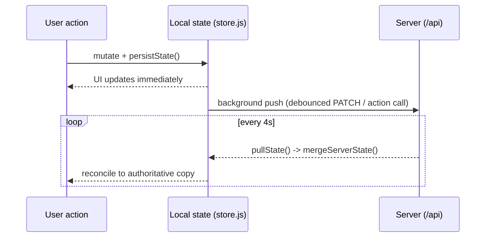
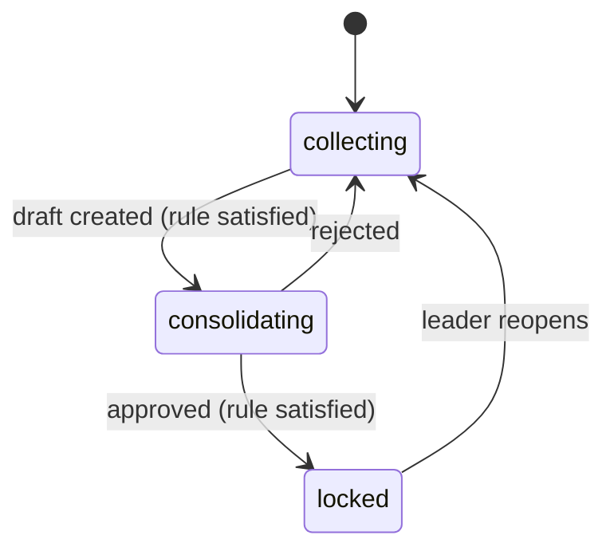

# Design Thinking Canvas — Architecture

Technical and architectural reference for the Design Thinking Canvas: a bilingual (EN / 中文) web app that guides a solo student or a distributed team through the Double Diamond design process, with an optional bring-your-own-key AI assistant and real cross-device team sync.

This document describes how the system is built, not how to use it. For the end-user tour, see `guide.html`. For deployment steps, see `DEPLOY.md`.

---

## 1. Overview and guiding principles

The app is deliberately a **static front end plus a thin serverless back end**. There is no front-end framework and no build step for the browser code — every page is plain HTML that loads a fixed set of classic `<script>` files. This keeps the app trivially hostable, inspectable, and long-lived.

A handful of principles shaped the design and should be preserved:

- **Solo-first, team-optional.** Every feature works with no account, no network, and no server — state lives in the browser. Team collaboration is strictly additive; when no team is connected, the sync layer is inert and the app behaves exactly like the local-only prototype.
- **Local-first + poll-merge sync.** When connected to a team, local edits still apply immediately for responsiveness; the same change is pushed to the server in the background, and a periodic poll pulls the authoritative server copy so every device converges within one poll interval.
- **Append-only, attributed contributions.** Teammates never silently overwrite each other. Each card/entry is attributed to its author. The only "merge" is an explicit, gated **consolidation** step.
- **The LLM never decides.** AI can suggest, rephrase, or draft, but it never invents a user's challenge and never finalizes a team decision. A consolidated summary becomes canonical only after the team's chosen approval rule is satisfied.
- **Server-authoritative permissions.** Client-side gating is for UX only. Every sensitive action is re-validated server-side against member credentials, because the client's local state is not trustworthy.

---

## 2. Tech stack and constraints

| Layer | Technology | Notes |
|---|---|---|
| Front end | Vanilla HTML/CSS/JS (ES2020, classic scripts) | No framework, no bundler, no transpile step |
| Page generation | Python 3 (`generate_pages.py`) | Build-time only; emits static stage/tool pages |
| Back end | Vercel serverless functions (Node, CommonJS) | File-based routing, no framework |
| Database | Postgres (Neon via Vercel Marketplace) | Accessed through node-postgres (`pg`) |
| AI | Any OpenAI-compatible / Anthropic provider | Bring-your-own-key, called directly from the browser |
| Tests | Node + `pg-mem` + `jsdom` | Three tiers; no real DB or browser required |

The only runtime dependency shipped to production is `pg`. Everything else (`pg-mem`, `jsdom`) is test-only.

---

## 3. Repository layout

```
/                         (project root = deployable static site + serverless API)
  index.html              Dashboard (project framing, board, onboarding)
  guide.html              In-app bilingual user guide
  report.html             Report generator page
  stages/*.html           7 generated stage pages (Discover … Reflect)
  tools/*.html            32 generated tool/method worksheet pages
  style.css               Single global stylesheet
  lang.js                 i18n dictionary + toggle + t()
  store.js                Client state model: multi-canvas persistence, team helpers
  sync.js                 Cloud sync client (local-first + poll-merge)
  settings.js             Unified Settings modal (Identity & AI | Teams & Canvases)
  team.js                 Renders the Teams & Canvases section into the Settings modal
  app.js                  Dashboard controller
  stage.js                Stage-page controller (cards, AI assist, team phase panel)
  tool.js                 Tool-page controller (worksheet capture, promote)
  report.js               Report compiler (data-only or AI narrative)
  llm.js                  BYOK LLM client (providers, key storage, completion)
  glossary.js             Term modal (data-term delegation)
  schema.sql              Postgres schema (idempotent)
  api/                    Vercel serverless functions
    _pool.js              Shared pool + one-time schema bootstrap
    _util.js              withHandler() wrapper (JSON, errors, CORS)
    projects/index.js     POST create / GET lookup-by-code
    projects/[id].js      GET full state / PATCH scalar fields
    projects/[id]/team.js POST join / PATCH rule / DELETE leave
    projects/[id]/entries.js  POST / PATCH / DELETE entries
    projects/[id]/phase.js    POST ready / consolidate / reopen
    consolidations/[id].js    POST approve / reject
  lib/logic.js            Pool-agnostic business logic (shared by all handlers + tests)
  test/                   logic.test.js, api.test.js, e2e.test.js (in the deploy copy)
```

Note: the browser-side JS files and the `api/`, `lib/`, `schema.sql` back-end files live side by side in the project root so a single `vercel --prod` (or a GitHub-connected deploy) publishes both the static site and the functions.

---

## 4. Front-end architecture

### 4.1 Page types and shared scripts

There are five kinds of page, each loading an overlapping set of the shared scripts:

| Page | Controller | Also loads |
|---|---|---|
| `index.html` (dashboard) | `app.js` | lang, store, llm, glossary, sync, team, settings |
| `stages/*.html` | `stage.js` | lang, store, llm, glossary, sync, team, settings |
| `tools/*.html` | `tool.js` | lang, store, llm, glossary, sync, team, settings |
| `report.html` | `report.js` | lang, store, llm |
| `guide.html` | (inline `state`) | lang, store, llm, glossary, sync, team, settings |

The scripts are **classic (non-module) scripts**. This matters: top-level `function` declarations become global properties, and a top-level `let`/`var state` declared by the page controller is shared across all scripts on that page. That is how `sync.js` and `team.js` read and mutate the same `state` object the controller owns, without any imports or a global registry. Only one controller per page declares `state`, so there is never a redeclaration clash.

### 4.2 Internationalization

`lang.js` holds a flat dictionary keyed by dotted strings (`"team.leaveButton": { en, zh }`) and exposes `t(key)`. Two mechanisms render bilingual content:

- **`data-i18n="key"`** attributes are resolved to the active language on load and on toggle (also `data-i18n-title`, `data-i18n-placeholder`, `data-i18n-html`).
- **Parallel spans** `<span class="lang-en">…</span><span class="lang-zh">…</span>`, toggled purely by CSS: `html[data-lang="en"] .lang-zh { display:none }` and vice-versa. `display:none` also hides the inactive language from screen readers.

The toggle sets `data-lang` on `<html>` and persists the choice in `localStorage["dtc-lang"]`. Long generated prose uses parallel spans; UI chrome uses `data-i18n`.

### 4.3 Static-site generator

`generate_pages.py` (kept in the build/outputs workspace, not shipped) emits the 39 stage and tool pages from structured data, so the header, nav strip, tool grids, worksheets, and script includes stay consistent across all pages. Any change to shared page structure is made in the generator and the pages are regenerated. The dashboard, report, and guide pages are hand-authored.

---

## 5. Client data model and persistence

### 5.1 Multi-canvas storage

A user can hold several independent **canvases** — one per team they've joined, plus any solo ones. Storage keys:

| Key | Contents |
|---|---|
| `dtc-canvas-index` | Array of canvas metadata: `{ id, title, projectId, joinCode, role }` |
| `dtc-active-canvas` | The id of the currently active canvas |
| `dtc-canvas-<id>` | The full state object for one canvas |
| `dtc-sync-creds-<projectId>` | `{ memberId, secret, name, role }` for a joined team |
| `dtc-llm-config-v1` | User settings: name, about, provider, model, key (browser-only) |
| `dtc-lang`, `dtc-intro-dismissed`, `dtc-selection-open` | UI preferences |

`store.js` keeps the public API stable — `loadState()` and `persistState(state)` have the same signatures they always had — but now read/write the **active** canvas. Because every page and controller only ever calls `loadState()`/`persistState()`, none of them had to change when multi-canvas was introduced. Management functions layer on top: `listCanvases`, `createCanvas`, `setActiveCanvas`, `deleteCanvas`, `updateCanvasMeta`, `getActiveCanvasMeta`, `activeCanvasId`.

The cloud link (projectId / joinCode / role) lives on the active canvas's metadata, so "connected" means "the canvas I'm currently looking at is a team canvas."

### 5.2 State shape

A single canvas's state object:

```
{
  title, challenge,
  foundations: { challenge, themes },
  selection:  { background, values, objectives, role, strengths, weaknesses,
                opportunities, threats, reflections, decision, scoped },
  brief:      { problem, users, needs, pov, hmw, objectives, success },
  cards:      { discover:[…], define:[…], … reflect:[…] },   // stage cards
  tools:      { <slug>: { phase, title, cards:[…] }, … },     // worksheet entries
  evalPlan:   [ … ],
  team:       null | { id, name, members:[{id,name,about,role}], settings:{approvalRule} },
  phaseStatus:   { <phase>: { status, readiness:{ <memberId>:true } } },
  consolidations:{ <phase>: [ { id, status, text, approvals, createdBy, … } ] }
}
```

A card carries `{ id, text, created, authorId, authorName }`. `authorId`/`authorName` are attached when a team member creates it; solo cards omit them.

### 5.3 Migration

On first load, `ensureCanvasMigrated()` seeds the index from the legacy single-canvas keys (`design-thinking-canvas-v2`, then `-v1`) and carries over the old global `dtc-sync-project` cloud link into the new canvas's metadata. It is idempotent and a no-op once an index exists.

---

## 6. Cloud sync architecture

`sync.js` connects the local state model to the back end. Its contract: when no project is connected, every function is a no-op.

### 6.1 Local-first + poll-merge



- Scalar-field edits (title, challenge, brief, …) funnel through `persistState()`, which calls `onStateSaved()` in `sync.js`; that debounces (800 ms) and PATCHes the project.
- Entry/team/phase actions call dedicated helpers (`syncAddEntry`, `syncUpdateEntry`, `syncDeleteEntry`, `syncSetReady`, `syncConsolidate`, `syncApprove`, `syncReject`, `syncReopen`, `syncSetApprovalRule`) that hit the API then `pullState()`.
- `mergeServerState()` overwrites the local scalar fields, cards, tools, team, phaseStatus, and consolidations with the server's copy, guarded by a `suppressPush` flag so the merge doesn't re-trigger a push loop.
- A single `setInterval` (`SYNC_POLL_MS = 4000`) drives the poll. It is idempotent (`startSyncPolling`/`stopSyncPolling`/`restartSyncPolling`) and no-ops when the active canvas isn't connected.

### 6.2 Create / join / leave

- **Create** turns the *current* canvas into a cloud project: `POST /api/projects`, join as leader, upload scalar fields, import existing local cards as the leader's attributed entries, then pull.
- **Join** always creates a **new** canvas and switches to it, so the canvas you were on is never overwritten. It looks up the code first (so a bad code fails cleanly with no stray canvas), then creates the canvas, links it, joins, and pulls.
- **Leave** (`syncLeaveTeam`) removes the member server-side (`DELETE /api/.../team`), then turns the active canvas solo, keeping only the cards the user authored.

### 6.3 Identity

`currentIdentity(state)` returns `{ id, name, role }`. When connected it comes from the stored creds; otherwise it falls back to the local `activeMember`. Stage/tool rendering uses this single accessor so the same code path renders whether the project is local-only or cloud-connected. Your name and optional "about yourself" come from Settings and are sent when you join; teammates see the "about" as a hover hint on names and author tags.

---

## 7. Back end

### 7.1 Serverless functions

Vercel maps files under `api/` to routes; bracketed filenames are dynamic params (`api/projects/[id].js` → `/api/projects/:id`). Files prefixed `_` are excluded from routing.

- **`_pool.js`** creates a shared `pg` Pool from `POSTGRES_URL` (or `DATABASE_URL` / `POSTGRES_URL_NON_POOLING`) and runs `ensureSchema()` once per cold start. Because every statement in `schema.sql` is idempotent (`CREATE TABLE IF NOT EXISTS`, `ADD COLUMN IF NOT EXISTS`), no separate migration step is needed.
- **`_util.js`** exports `withHandler(fn)`, which parses the JSON body, injects the pool, maps thrown `httpError(status, message)` to responses, and sets headers.

### 7.2 Business logic (`lib/logic.js`)

All logic lives in one module whose functions take a node-postgres-compatible `pool` first (`pool.query(text, params) -> { rows }`). This makes the exact same code run against real Postgres in production and against `pg-mem` in tests. Handlers are thin: they parse the request and call one logic function.

Exports: `createProject, getProject, getProjectByJoinCode, updateProjectFields, verifyMember, requireMember, listMembers, createOrJoinTeam, removeMember, setApprovalRule, addEntry, updateEntry, deleteEntry, setReady, allReady, canConsolidate, createConsolidationDraft, getConsolidation, approveConsolidation, rejectConsolidation, reopenPhase, getProjectState`.

### 7.3 Database schema

Six tables, all children cascade from `projects`:

| Table | Purpose | Key columns / rules |
|---|---|---|
| `projects` | One shared canvas | `join_code` unique; scalar fields (challenge, foundations, brief, …) as JSONB; `approval_rule` (`leader`\|`consensus`) |
| `members` | Team roster | `name`, `about`, `role` (`leader`\|`member`), `secret` (bearer credential) |
| `entries` | Stage cards **and** tool entries | `tool_slug` null for stage cards; `member_id` FK **ON DELETE SET NULL** (entries survive a member leaving, but lose attribution); `author_name` retained as text |
| `phase_status` | Per-phase lifecycle | `status` (`collecting`\|`consolidating`\|`locked`) |
| `readiness` | Per-member "ready" flags | FK **ON DELETE CASCADE** |
| `consolidations` | AI draft summaries | `status` (`draft`\|`approved`\|`rejected`), `approvals` JSONB, `created_by` |

Stage cards and tool-worksheet entries deliberately share one append-only `entries` table, discriminated by a nullable `tool_slug`.

### 7.4 API surface

| Method + path | Logic | Notes |
|---|---|---|
| `POST /api/projects` | `createProject` | Returns `{ projectId, joinCode }` |
| `GET /api/projects?code=` | `getProjectByJoinCode` | Resolve a join code (case-insensitive) |
| `GET /api/projects/:id` | `getProjectState` | Full aggregated state for the client |
| `PATCH /api/projects/:id` | `updateProjectFields` | Whitelisted scalar fields, last-write-wins |
| `POST /api/projects/:id/team` | `createOrJoinTeam` | First member → leader; carries `name`, `about` |
| `PATCH /api/projects/:id/team` | `setApprovalRule` | Leader only |
| `DELETE /api/projects/:id/team` | `removeMember` | Self-leave, or leader removes another |
| `POST /api/projects/:id/entries` | `addEntry` | Attributed if `memberId` given |
| `PATCH /api/projects/:id/entries` | `updateEntry` | Author only |
| `DELETE /api/projects/:id/entries` | `deleteEntry` | Author or leader |
| `POST /api/projects/:id/phase` | `setReady` / `createConsolidationDraft` / `reopenPhase` | `action` field selects |
| `POST /api/consolidations/:id` | `approveConsolidation` / `rejectConsolidation` | `action` field selects |

---

## 8. Permission and consent model

Client-side checks (hiding a delete button, disabling Edit for non-leaders) are UX only. The server re-validates every sensitive action via `requireMember(pool, projectId, memberId, secret)` plus role/ownership checks:

- **Edit an entry** — author only.
- **Delete an entry** — author, or the team leader. Unattributed entries still require a valid member credential once the project has members.
- **Change the approval rule** — leader only.
- **Trigger consolidation** — per the rule: `leader` requires the leader; `consensus` requires everyone marked ready.
- **Approve / reject a draft** — per the rule: leader, or (consensus) every member individually.
- **Reopen a locked phase** — leader only.
- **Remove a member** — yourself, or (as leader) anyone. A sole departing leader hands off to the oldest remaining member.
- **Rename the project** — UX-gated to the leader (solo owner otherwise). Title is ordinary shared scalar state, so this is enforced in the client rather than the API.

---

## 9. Consolidation lifecycle

Per phase, the status moves through a small state machine. The AI only ever produces a *draft*; the transition to `locked` requires human approval under the team's rule.



On approval, an attributed "Team (consolidated)" entry is inserted; individual cards are never replaced.

---

## 10. AI layer (bring-your-own-key)

`llm.js` is a provider-agnostic client. The user picks a provider and pastes an API key in Settings; the config (including the key) is stored **only** in `localStorage["dtc-llm-config-v1"]` and is explicitly excluded from Export. Completions are called directly from the browser to the provider. Without a key, every AI button degrades gracefully and the app is fully usable. Prompt construction is personalized with the user's "about yourself" note and always instructed to use only the user's content, flag gaps rather than invent, and never finalize decisions.

---

## 11. Testing strategy

Three tiers, all runnable with plain Node — no real database or browser:

1. **`logic.test.js`** exercises `lib/logic.js` against `pg-mem` (an in-memory Postgres emulator loaded with the real `schema.sql`). Covers auth-by-secret, leader vs. consensus approval, entry ownership, member removal / unattribution / leader-handoff.
2. **`api.test.js`** calls the real `api/*` handler files with mock req/res, through a `pg-mem`-backed shim for the `pg` module, so routing, status codes, and error mapping are exercised as in production.
3. **`e2e.test.js`** runs two independent `jsdom` "devices" executing the **real** browser scripts against the **real** handlers via an in-process fetch router. This is the closest pre-deploy check to "two people on different computers": create/join through the unified modal, cross-device sync, multi-canvas isolation, about-propagation, the consolidation flow, and the full leave-team flow.

Testing quirks handled: `pg-mem` needs `impure: true` on `gen_random_uuid` and can't run `CREATE EXTENSION` (stripped in the test shim); the shim also strips `ADD COLUMN IF NOT EXISTS` edge cases; and the e2e harness force-exits because the sync poll's `setInterval` keeps the loop alive.

---

## 12. Deployment

Target: Vercel (static site + functions) with Neon Postgres from the Vercel Marketplace.

1. Provision Postgres (`vercel install neon`, or the dashboard Storage tab). Ensure the injected variable is named `POSTGRES_URL` (or `DATABASE_URL`).
2. Deploy. `_pool.js` runs `schema.sql` on the first request per cold start, so no manual migration is needed **for a fresh database**.
3. Environment variables are snapshotted at deploy time — adding the DB integration after a deploy requires a **fresh deploy** for the variable to reach the running functions.

Migration caveat: `schema.sql` uses `CREATE TABLE IF NOT EXISTS`, so a column added to an *existing* table won't appear from the `CREATE` alone. The `members.about` column ships with a companion `ALTER TABLE … ADD COLUMN IF NOT EXISTS` for exactly this reason; follow that pattern for any future column on an existing table.

---

## 13. Known constraints and future directions

- **Title rename is client-enforced.** Because scalar fields are collaboratively editable shared state, the leader-only rename is a UI gate, not an API check. Enforcing it server-side would mean threading credentials through the scalar PATCH.
- **Member `secret` is a bearer token in `localStorage`.** Adequate for a classroom tool; a production system would move to real auth (the Neon/Stack "Auth" toggle is available but unused).
- **Polling, not push.** A 4-second poll is simple and robust; websockets/SSE would cut latency at the cost of infrastructure.
- **The AI key is in the browser.** By design (BYOK, no server relay). A shared/managed-key deployment would need a server-side proxy.

---

*Companion documents: `guide.html` (end-user guide), `DEPLOY.md` (deployment steps), `README.md` (project intro).*
